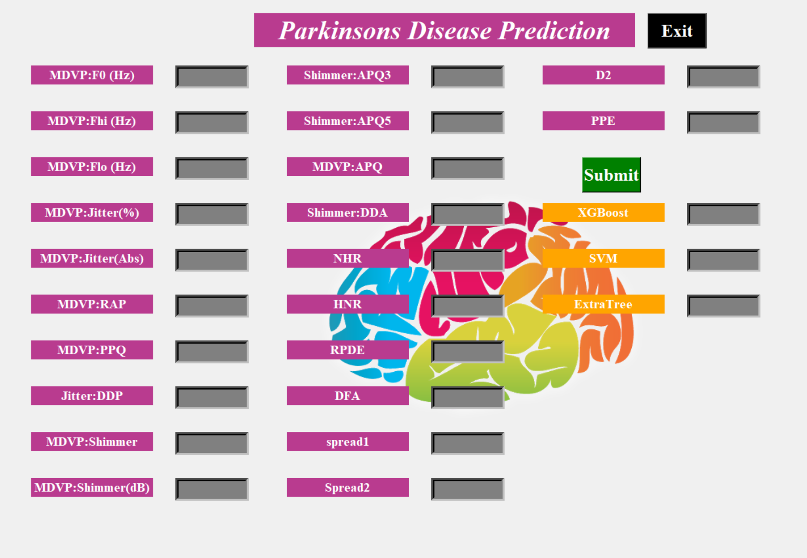

# 🧠 Parkinson's Disease Prediction System

This project predicts the likelihood of Parkinson’s Disease in individuals using various machine learning models trained on biomedical voice measurements. It includes:

- A **Jupyter Notebook** (`FinalFullProject.ipynb`) for data exploration, model training, and evaluation.
- A **Tkinter-based Desktop Application** (`FullUI.py`) that allows users to input medical parameters and receive real-time predictions using trained models.

---

### 🖼️ UI Preview

> Here's a glimpse of the Parkinson's Prediction App in action:

> 

---

## 🗂️ Project Structure


parkinsons-disease-prediction/
│
├── assets/                  # Brain image used in the UI (e.g., b2.png)
├── data/                    # Dataset (e.g., parkinsons.csv)
├── notebooks/               # Jupyter notebook for model training (FinalFullProject.ipynb)
├── src/                     # Python code for the GUI (FullUI.py)
│
├── .gitignore               # To ignore unnecessary files/folders
├── requirements.txt         # Required Python packages
├── README.md                # Project documentation


---

## 🎯 Project Objectives

- Analyze biomedical voice data to identify patterns associated with Parkinson’s Disease.
- Train multiple ML models to predict the presence of the disease.
- Develop a full-screen graphical interface (GUI) for non-technical users (e.g., doctors, medical staff) to interact with the model without needing to code.

---

## 🔬 Dataset Overview

- Source: [UCI Machine Learning Repository](https://archive.ics.uci.edu/ml/datasets/parkinsons)
- Samples: 195 voice recordings
- Features: 22 biomedical voice features like MDVP:Fo(Hz), Jitter, Shimmer, NHR, HNR, RPDE, DFA, spread1, D2, PPE.
- Target: `status` → 1 (Parkinson's Positive), 0 (Healthy)

---

## 📈 Machine Learning Models Used

Implemented and compared three models:
- **XGBoost Classifier**
- **Support Vector Machine (SVM)** — with `rbf` kernel
- **Extra Trees Classifier**

Each model was trained using:
- Scikit-learn pipeline
- Feature scaling with `MinMaxScaler`
- Evaluation using accuracy score and confusion matrix

---

## 🖥️ Application: Tkinter-Based User Interface

The `src/FullUI.py` script is a full-screen interactive desktop application developed using **Tkinter**. It allows users to input 22 medical voice measurements and get predictions from all three ML models.

### 🔧 Key Functionalities:

- **Clean Fullscreen UI** with a colorful brain background (`b2.png`)
- **Manual Input Fields** for each feature (e.g., MDVP:F0, Jitter, Shimmer)
- **Submit Button** to trigger prediction logic
- **Real-time Prediction** displayed for:
  - XGBoost
  - SVM
  - Extra Trees
- **Exit Button** to close the application

### 🧠 How Predictions Work:

1. The app reads the original `parkinsons.csv` dataset.
2. The user’s input is appended as a new record to the dataset.
3. The data is scaled and split into training and test sets.
4. The last row (user input) is used to make predictions.
5. The output shows if the person **likely has Parkinson’s (YES/NO)** for each model.

---


### 🚀 How to Run the Project

1. **Clone the repository:**
   ```bash
   git clone https://github.com/ManiShankar6/projects.git
   cd projects/parkinsons-disease-prediction
2. **Install dependencies:**
   ```bash
   pip install -r requirements.txt
3. **Run the desktop application (Tkinter UI):**
   ```bash
    python src/FullUI.py